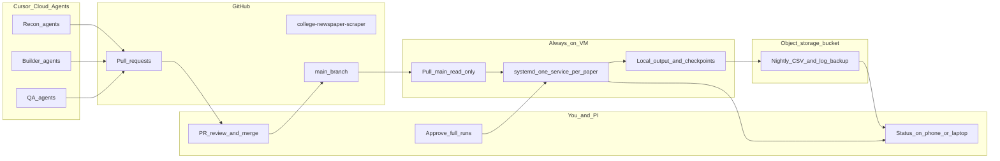

# Cloud Plan — Parallel Agents + Always-On Scraper VM

**Audience:** PI / research lead review  
**Status:** Plan only (no cloud resources created; no scraper code changed in this pass)  
**Date:** 2026-09-24  
**Repo:** `college-newspaper-scraper`  
**Hard rules still apply:** frozen 10-column schema; crawl delays; `max_concurrency: 1` per domain; honest research UA by default; browser UA only for approved Duke/Yale paths; no proxies / IP rotation / CAPTCHA solving; `config/sites.yaml` is lead-owned; corpus CSVs never in Git.

---

## 0. First-batch goal (scope this plan serves)

| Tab | Target for first batch | Notes |
| --- | ---: | --- |
| National Universities | 10–20 universities | 101 rows with URLs |
| Liberal Arts | 10–20 universities | Only 49 rows currently have URLs |
| Public Universities | 10–20 universities | Tab has only 20 rows total |
| Christian Colleges | 10–20 universities | Tab has only 16 rows (15 with URLs) |

Several universities appear on more than one tab and share one newspaper domain, so **unique papers ≈ 40–70** for this batch (**guess** until the exact 10–20 picks per tab are locked).

**Corpus definition per paper:** every article from **2000-01-01 to today**, all sections, using on-page publication date (not sitemap `lastmod`).

**Evidence from the four built sites** (`recon/FULL_CORPUS_AUDIT.md`):

| Site | ~URLs (2000+) | Crawl delay | Est. fetch hours |
| --- | ---: | --- | ---: |
| Chicago Maroon | ~22k | 6–8 s | ~44 h |
| Northwestern | ~70k | 6–8 s | ~137 h |
| Duke Chronicle | ~40k–65k (**guess**) | 10–12 s | ~131–211 h (**guess**) |
| Yale (live site only) | ~1k current sitemap | Playwright | ~0.9 h for current 1k; full history unknown |

Laptop overnight scraping is too slow for a 40–70 paper batch. This plan separates **coding** (Cursor Cloud Agents → GitHub PRs) from **fetching** (one always-on VM running approved scrapers).

---

## 1. Plain-language overview (one paper, end to end)

Example: **Stanford Daily** (`stanforddaily.com`) after the first-batch list is chosen.

1. **Recon agent (Cloud or local)**  
   Reads the target tracker, checks `robots.txt`, finds sitemap/RSS/sections, guesses platform (e.g. WordPress/SNO), notes crawl delay and risks. Updates tracker status. **Does not** download the full article corpus.

2. **Builder agent (Cloud)**  
   Implements discovery + article parsing for that platform (or reuses an existing WordPress/SNO adapter). Adds fixtures/unit tests. Proposes a `sites.yaml` block in `docs/requests/stanford.md` (**does not** edit `config/sites.yaml` itself). Opens a **GitHub pull request**.

3. **QA agent (Cloud)**  
   Runs offline tests; checks frozen schema; may run a tiny bounded live sample only if the PR and playbook gates allow. Comments on the PR with pass/fail and spot-check notes.

4. **You (human review + merge)**  
   Review the PR diff. Merge to `main` only when satisfied. You (or Lead) paste the approved block into `config/sites.yaml` and merge that as a separate, explicit change if needed. **You** approve any full-corpus launch.

5. **Server picks up `main`**  
   A read-only deploy key pulls the latest `main` on a schedule or on demand. No Cloud Agent writes to the scrape server. No scrape runs from a feature branch.

6. **Full run on the VM**  
   A per-paper background service starts  
   `python run.py --site stanford --mode full`  
   with the paper’s configured delay, domain lock, checkpoints, and failure log. It resumes after crashes/reboots.

7. **Backup**  
   Nightly job uploads `output/*.csv`, `logs/checkpoints/`, and `logs/failed_*.csv` to an object-storage bucket (versioned).

8. **Delivery**  
   You download CSVs from the bucket (or a signed link), validate row counts / years / empties, mark the tracker `done`, and share the batch with the PI.

```text
Target list → Recon → Builder PR → QA → Your merge → VM pulls main
    → full scrape (checkpointed) → nightly backup → you deliver CSV
```

---

## 2. Architecture diagram



**What never flows where**

| Must not | Why |
| --- | --- |
| Cloud Agents → write `output/` on the VM | Agents code/test only; scrapes are VM + your approval |
| Feature branches → production scrape | Only `main` after merge |
| Corpus CSVs → GitHub | Size + policy; bucket + local disk only |
| Proxies / rotating IPs | Violates project rules; Duke/Yale blocks handled by local fallback |

---

## 3. Cloud provider options

| Option | Beginner setup | Cost (order of magnitude) | Fit for weeks-long polite scrapers | Notes |
| --- | --- | --- | --- | --- |
| **AWS** (EC2 or Lightsail) | Medium (Lightsail easier than raw EC2) | VM ~$20–80/mo; S3 cheap | Excellent | Huge ecosystem; Columbia often already has AWS relationships |
| **Google Cloud** (Compute Engine + GCS) | Medium | Similar to AWS | Excellent | Clean storage story; good docs |
| **Azure** | Medium–Hard for solo beginners | Similar | Excellent | Often heavier org/IAM friction |
| **Columbia-managed / Research Computing** | Easy for you if IT provisions; hard if you self-serve outside policy | May be subsidized or grant-billed | **Best compliance fit** if long-running outbound HTTP is allowed | **Must confirm:** outbound scraping allowed, always-on VM available, data egress rules |

### Recommendation

1. **First choice:** Ask the PI / Columbia IT whether a **Columbia-managed cloud account** (or research VM) can host an always-on Linux box with unrestricted outbound HTTPS and a storage bucket. Billing and compliance are simpler for a grant-funded project.  
2. **If self-serve commercial cloud is required:** **AWS Lightsail** or a small **EC2 + S3** setup — widely documented, easy snapshots, S3 backups. GCP Compute Engine + GCS is an equally good alternative if the lab already uses Google.

**Why not “ whichever is cheapest this week”:** for a multi-week crawler, reliability, snapshots, and who can pay the bill matter more than saving ~$10/month.

**Critical Columbia question (blocker):** some research clusters disallow or throttle long-running outbound crawlers. The VM must be a **general-purpose cloud VM** (or explicitly approved research VM), not a shared HPC login node.

---

## 4. Server sizing

Scraping here is **network-and-politeness bound**, not CPU-bound. One process per newspaper; each process mostly sleeps between requests.

### Recommended starting VM (first batch)

| Resource | Recommendation | Reasoning |
| --- | --- | --- |
| vCPUs | **4** | Enough for 8–12 sleeping request workers + OS + 1 Playwright job |
| RAM | **16 GB** | Request scrapers are light; Playwright needs headroom |
| Disk | **200–500 GB SSD** | Full-text CSVs grow; Chicago alone is already multi‑MB and rising; dozens of papers need headroom + logs |
| OS | **Ubuntu 22.04/24.04 LTS** | Simple systemd + Python |
| Network | Public IPv4, stable | Sites see one datacenter IP |

### Concurrency limits (safe defaults)

| Scraper type | RAM hint | Concurrent papers on this VM |
| --- | --- | --- |
| Plain `requests` (Chicago, Northwestern, most WordPress) | ~50–150 MB each | **8–12** |
| Playwright / heavy browser (Yale-class) | ~1–2 GB each | **1–2** |
| Mixed | — | e.g. **8 request + 1 Playwright** |

**Do not** raise `max_concurrency` above 1 per domain. Parallelism means **more papers**, not faster hits on one paper.

### Disk growth (**guess**)

- Rough: 5–30+ KB of CSV text per article depending on length.  
- 50 papers × 30k articles × 15 KB ≈ **~20+ GB** of CSVs (**guess**), plus checkpoints, logs, browser cache.  
- Plan **≥200 GB** attached disk and prune/rotate scrape logs; keep authoritative copies in the bucket.

---

## 5. What changes in the repo to run on a server

*(Planned work — not implemented in this document pass.)*

### 5.1 One background service per paper (recommended: `systemd`)

**Recommendation: `systemd` user or system units**, one unit per `site_key`.

Why systemd over raw `tmux` on a server:

- Restarts on crash (`Restart=on-failure`)
- Starts on reboot
- Logs via `journalctl`
- Clear start/stop without attaching a terminal

Each unit would run something equivalent to:

```bash
/opt/newspaper-scraper/.venv/bin/python run.py --site <site_key> --mode full
```

Working directory = the server checkout. Checkpoints already make resume safe after kill/reboot.

`tmux` remains fine for **laptop** use; the server should graduate to systemd.

### 5.2 Fresh Ubuntu setup script (planned: `scripts/server_bootstrap.sh`)

Would install: Python 3, venv, git, optional Playwright browsers, create app user, clone repo with deploy key, install requirements, create `output/` / `logs/` directories, install systemd templates, configure logrotate.

### 5.3 How the server gets code

| Mechanism | Detail |
| --- | --- |
| Auth | **Read-only** GitHub deploy key on the VM (write disabled) |
| Branch | **`main` only** |
| Cadence | `git fetch && git reset --hard origin/main` on a timer **or** manual `deploy.sh` after you merge |
| Rule | Never scrape from unmerged Cloud Agent branches |

### 5.4 Nightly backup

- Cron or systemd timer → sync `output/`, `logs/checkpoints/`, `logs/failed_*.csv` to bucket (`aws s3 sync` / `gsutil rsync`)  
- Keep checksums (e.g. `sha256sum`) alongside uploads  
- Bucket versioning on

### 5.5 Status you can check from phone/laptop

Minimum viable (cheap, secure):

1. **Health file** updated every N minutes: rows committed, checkpoint time, service active/failed  
2. Upload that tiny JSON to the bucket or a private gist  
3. Optional: email/Slack webhook on service failure  

Later nicety: a password-protected status page on localhost + SSH tunnel — not required for v1.

### 5.6 Where outputs live

| Location | Contents |
| --- | --- |
| VM disk `output/` | Live CSVs (gitignored) |
| VM `logs/` | Checkpoints, failures, scrape logs |
| Object bucket | Nightly backups + status snapshots |
| GitHub | Code, fixtures, tracker CSVs — **not** corpus CSVs |

---

## 6. Cursor Cloud Agents

### 6.1 Beginner steps (how they attach to GitHub)

1. Repo already on GitHub (`valentinasilva8/college-newspaper-scraper`).  
2. In Cursor, connect GitHub and enable **Cloud Agents** for this repo.  
3. Cloud Agent clones the repo in an isolated environment, edits on a branch, runs tests, opens a **PR**.  
4. You review/merge in GitHub (or Cursor).  
5. Only after merge does the **VM** pull `main`.

Cloud Agents are for **code + tests**, never for the multi-day corpus scrape.

### 6.2 How many at once / how to split work

| Phase | Parallelism | Split by |
| --- | --- | --- |
| Before platform adapters exist | 1 Lead + 1 Recon | Universities for recon only |
| After `src/platforms/` exists | **3–5** Cloud Agents | **Platform**, not university: WordPress/SNO, SNWorks, Playwright/custom |
| Builders | 1 agent per platform PR stream | Many universities share one adapter |

**Do not** start 20 builder agents each inventing a one-off scraper for the same WordPress theme.

### 6.3 Approval gates (same playbook, cloud edition)

1. Offline unit/fixture tests in the PR.  
2. Human reviews shared-file diffs (`sites.yaml` proposals, extractors).  
3. Bounded live test (e.g. max 200) — preferably **on the VM** after merge, or explicitly approved.  
4. Explicit human approval before enabling the systemd full-run unit.  
5. Builders never merge themselves to production scrape config without Lead/you.

### 6.4 Usage cost / is Pro enough?

| Item | Estimate | Confidence |
| --- | --- | --- |
| Cursor Pro for you | Current personal Pro plan | Known if you already pay it |
| Cloud Agent compute/tokens | **Guess:** tens to low hundreds of USD over 3 months if 3–5 agents used heavily for builders | **Guess** — Cursor pricing/usage caps change; watch the dashboard |
| Is Pro enough? | **Likely yes** for 3–5 concurrent coding agents and recon | **Guess**; scale agents only after watching usage |

If Cloud Agent quotas become tight: keep Recon local, reserve Cloud for Builder/QA PRs.

---

## 7. Risks and handling

### 7.1 Datacenter IP blocked (Duke / Yale especially)

| Step | Action |
| --- | --- |
| Before any full run from the VM | **Access probe:** fetch homepage + 3 article URLs + robots with the same UA the scraper uses; record status codes |
| If blocked (403/challenge) | **Fallback: run that site on your laptop/home IP only** |
| Never | Proxies, residential IP pools, or CAPTCHA farms |

Expect higher risk for Duke (WAF) and Yale (bot checkpoint) than for Chicago/Northwestern.

### 7.2 Security basics

- SSH **key only** (disable password login)  
- Firewall: allow SSH from your IPs (or Columbia VPN); egress HTTPS open  
- Deploy key **read-only**  
- Bucket private; no public ACLs  
- Secrets (contact email in UA is fine in repo; AWS keys, SSH keys, webhook URLs) in **`/etc/newspaper-scraper.env` or similar outside git**  
- Separate OS user to run scrapers (not root)

### 7.3 Crash / disk / site errors

| Failure | Behavior |
| --- | --- |
| Process crash | systemd restarts; checkpoint resume skips committed URLs |
| VM reboot | units come back; same resume |
| Disk full | Scrapes fail; alert via status job; enlarge volume; prune logs; rely on bucket copies |
| Site returns mass errors | Failure log fills with `network_error` / empty bodies; **stop that unit**, investigate; do not “fix” with IP rotation |
| Bad merge to `main` | Revert on GitHub; VM redeploy previous good commit; scrapes resume from checkpoints |

---

## 8. Cost estimate (3-month first batch)

**Assumptions (mark carefully):**

- Always-on VM equivalent to ~4 vCPU / 16 GB / 250 GB SSD.  
- 8–12 concurrent request scrapers most of the time.  
- Nightly backups &lt; 100 GB stored average over the quarter (**guess**).  
- Modest egress (downloads to your laptop, not huge public traffic).  
- Cursor Pro already available; Cloud Agents used moderately.  
- Prices are **2025–2026 ballpark USD**; actual Columbia rates may differ.

| Line item | Monthly (**guess**) | 3 months (**guess**) |
| --- | ---: | ---: |
| Compute VM | $40–80 | $120–240 |
| Object storage + versions | $5–15 | $15–45 |
| Data transfer | $5–20 | $15–60 |
| Cursor Pro + Cloud Agent overage | $20–100 | $60–300 |
| **Total** | **~$70–215** | **~$210–645** |

**Not included:** your time; PI/IT overhead; Playwright-heavy papers increasing RAM tier; a second VM if Duke/Yale must stay local-only for months.

**Sensitivity:** If Columbia subsidizes the VM, cash cost may be near **$0 compute** + storage only.

---

## 9. Timeline (from approval)

| Milestone | Realistic window | Depends most on |
| --- | --- | --- |
| **(a) Server running the 4 built sites** | **2–4 weeks** | Columbia account approval; VM provision; bootstrap; IP access probes; migrate Chicago/NW jobs |
| **(b) First batch fully *built* (scrapers coded for ~40–70 papers)** | **6–14 weeks** | Platform adapter refactor landing first; Cloud Agent throughput; how many non-WordPress outliers |
| **(c) First batch fully *scraped*** | **+1–4 months after (b)** overlapping with builds | Per-site hours (44–211 h each); parallelism 8–12; blocks; discovery gaps (Duke/Yale) |

**Wall-clock intuition:** even with 10 parallel papers, a Northwestern-sized job is still ~6 days by itself; a Duke-sized guess is ~1–2 weeks. The batch finishes when the **slowest / last** papers finish, not when the average does.

**Critical path:** (1) PI/IT cloud approval → (2) finish platform split in repo → (3) parallel builders by CMS → (4) VM fleet of systemd units.

---

## 10. Setup checklist

| # | Step | Who |
| ---: | --- | --- |
| 1 | Approve first-batch university picks (10–20 per tab) and Yale library scope | **You + PI** |
| 2 | Confirm funding + whether account is Columbia-managed | **PI** |
| 3 | Confirm outbound scraping / always-on VM allowed | **PI + Columbia IT** |
| 4 | Create cloud project, billing, IAM | **PI / Columbia IT** (you assist) |
| 5 | Provision Ubuntu VM + firewall + SSH keys | **You** (or IT); agent can draft commands |
| 6 | Create private storage bucket + versioning | **You** / IT |
| 7 | Create read-only GitHub deploy key; add to repo | **You** |
| 8 | Write/run `server_bootstrap.sh`, systemd templates, backup timer | **Agent implements; you run on VM** |
| 9 | Deploy secrets file outside git | **You** |
| 10 | Access probe: Chicago, Northwestern, Duke, Yale from VM IP | **You** (agent can provide script) |
| 11 | Move/resume 4 built full runs on VM (or keep Duke/Yale local if blocked) | **You** |
| 12 | Complete extractor split + platform adapters on `main` | **Lead agent + your review** |
| 13 | Enable Cloud Agents on the GitHub repo | **You** |
| 14 | Recon wave for first-batch domains | **Cloud/local Recon agents** |
| 15 | Builder PRs by platform; QA; you merge | **Agents + You** |
| 16 | Enable systemd units only after bounded tests + your OK | **You** |
| 17 | Monitor status; nightly backup verify | **You** (weekly) |
| 18 | Deliver CSVs + tracker update to PI | **You** |

---

## 11. Open questions (need answers before building)

1. **Billing identity:** Personal cloud reimbursed by PI, or **Columbia-managed** project required?  
2. **Columbia IT:** Is an always-on VM with continuous outbound HTTPS to arbitrary news sites allowed? Any registration of the research bot UA/contact required?  
3. **First-batch list:** Exact 10–20 universities per tab (and how to treat shared-domain duplicates)?  
4. **Yale:** Live site only for this batch, or is the Library archive in scope? (Separate design if yes.)  
5. **Duke/Yale if datacenter-blocked:** Is “those two stay on the laptop” acceptable to the PI?  
6. **Contact identity in User-Agent:** Keep current research contact email, or a Columbia PI/lab address?  
7. **Data retention / sharing:** Who may download the bucket? Any IRB/data-classification constraints on article text?  
8. **Cursor:** Confirm Pro + Cloud Agents enabled for this GitHub org/user; any spend cap?  
9. **Priority inside the batch:** Finish the four built sites on the VM first, or start recon/builders in parallel immediately?  
10. **Disk/region preference:** Any requirement that data stay in-region (e.g. US-East) for Columbia policy?

---

## 12. Bottom line for the PI

- **One shared codebase**; each newspaper is a configured plugin, not a separate product.  
- **Cloud Agents** accelerate *writing* scrapers via GitHub PRs.  
- **One always-on VM** runs *approved* scrapes in parallel (about **8–12** polite request-based papers at once; **1–2** browser-based).  
- **Cost ballpark:** a few hundred dollars over three months on a commercial cloud (**guess**), possibly less under Columbia subsidy.  
- **Laptop remains the fallback** for sites that block datacenter IPs — without violating the no-proxy rule.  
- **No build/scrape starts on cloud** until the open questions above are answered and this plan is approved.

---

*End of plan. No cloud resources were created and no application code was changed in producing this document.*
